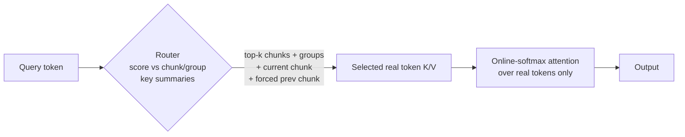

# Hierarchical Global Attention — 40M SmallLM

A drop-in causal attention that replaces dense O(S²) attention with a
**chunk-routed** scheme. It is initialized from a normal dense checkpoint and
fine-tuned, so it keeps the same `q/k/v/o` projection names and loads dense
weights directly. The goal: keep quality while making long-context training and
prefill **much cheaper** than dense attention.

---

## How the attention works

The sequence is cut into **chunks** (here `chunk_size=64`), and each chunk into
small **groups** (`group_size=16`, i.e. 4 groups/chunk). For every query the
module does two cheap things instead of an all-pairs softmax:

1. **Route (selection only).** The query is scored against compact per-chunk and
   per-group **key summaries** (built with a mixed-RoPE rule so they stay close
   to true RoPE geometry). It keeps the top chunks (`topk_chunks=20`) and top
   groups (`topk_groups=32`), always including the current chunk exactly and
   forcing the immediately-previous chunk to stay visible.
2. **Attend over real tokens.** Online-softmax attention is then computed over
   the **real token K/V** of the selected chunks/groups only — no summary vector
   ever enters the attention math. This is what makes it safe to load weights
   from a model that never saw the summaries.

Because each query attends to a *bounded* set of routed tokens (plus its own
chunk) rather than the whole prefix, the cost grows far more slowly than dense
attention's quadratic scaling. The attention is causal, uses grouped-query
attention (`nhead=6`, `kv_heads=2`) and RoPE, and exposes a single `forward`
path — there is **no KV cache and no separate decode kernel**: to extend a
context you simply run the model on the whole currently-available prefix
("big-block preprocessing").



---

## Repository layout

| Folder | Implementation | Status |
|---|---|---|
| [`Compiled/`](Compiled/) | **Triton-fused Exact-Q** hierarchical attention, compiled with `torch.compile`. | Fast path used for the headline results below. |
| [`NotOptimized/`](NotOptimized/) | Earlier **eager** routed implementation (`HierarchicalGlobalAttentionRouted`, plain PyTorch einsum + softmax + gather). | Reference / correctness harness. Slower, but still beats dense at long context. |

---

## Results (Compiled, Triton-fused)

Measured on an **NVIDIA RTX A4000**, PyTorch 2.10 (cu128), fp32, `torch.compile`,
batch size 1, at a **12,288-token** context. See
[`Compiled/benchmark_report.md`](Compiled/benchmark_report.md) for the full
report and methodology.

- **train** = one forward + backward over the whole block (per-step fine-tuning cost).
- **generate (big-block preprocessing)** = forward-only prefill of the whole block under `inference_mode`.
- **Dense RoPE** = the same module with `use_global=False` (causal `scaled_dot_product_attention` over RoPE q/k).

| Model | train ms | train tok/s | generate ms | generate tok/s |
|---|---:|---:|---:|---:|
| **HA (hierarchical)** | **299.89** | **40,976** | **102.98** | **119,322** |
| Dense RoPE | 815.56 | 15,067 | 249.87 | 49,177 |

At 12K tokens the hierarchical attention is **~2.7× faster to train** (0.37× of
dense wall-clock) and **~2.4× faster to prefill/generate** (0.41× of dense).

### The longer the context, the bigger the win

Dense attention is quadratic in sequence length (O(S²)), while hierarchical
attention attends to a bounded routed working set and scales much more gently.
HA throughput stays roughly flat as the context grows, whereas dense throughput
keeps dropping — so **the gap in favor of hierarchical attention widens as the
context length increases**.

---

## About `NotOptimized/`

`NotOptimized/` keeps the earlier **eager** routed attention used as a
correctness harness: with `use_summaries=False` it reproduces true dense
attention to ~1e-6, proving the routing math is exact. It is, of course,
**slower than the Triton-fused `Compiled/` version** (it launches many small
eager kernels instead of one fused kernel). Even so, it is **sub-linear in
context length**: it closes the gap with dense attention around **~8K tokens**
and pulls ahead for longer contexts, where its bounded working set beats dense's
O(S²) growth. Details and the recorded numbers are in
[`NotOptimized/benchmark_results.txt`](NotOptimized/benchmark_results.txt).

---

## Accuracy of the chunk-routed attention (no summaries)

The routed attention attends over **real token K/V only**
(`attend(use_summaries=False)`) — no approximate summary vector ever enters the
softmax. This is what keeps it loadable straight from a dense checkpoint, and it
means the only quality cost is the *sparse routing* itself (each query sees a
bounded routed working set instead of the full prefix).

The routing policy keeps a few chunks always visible per query:

- **`keep_first`** — the first *N* chunks (attention sinks) stay resident.
- **`keep_last`** — the last *N* closed chunks before the query (the recent
  window) stay resident, token-level.
- everything in between competes for the `topk_chunks` / `topk_groups` budget.

### Result — routing approximation only (no fine-tuning)

Loading the **same** dense weights into both models (no HA/QK fine-tuning) and
averaging next-token loss over **20 distinct FineWeb documents** at an
**8,192-token** context, with `keep_first=6`, `keep_last=6`:

| Model (identical weights) | loss (nats) | ppl |
|---|---:|---:|
| Dense (causal SDPA) | 3.70516 | 40.657 |
| Chunk-routed (`use_summaries=False`) | 3.72344 | 41.406 |
| **Δ (routed − dense)** | **+0.018 nats** | **+1.8% ppl** |

So with no weights ever adapted to the routing, the sparse chunk-routed
attention is within **~0.02 nats** of dense at 8K tokens. Raising `keep_last`
tightens the gap further (it exposes more of the recent window token-level).

### Reproduce / explore the policy

```bash
# routing approximation only — same weights for dense and routed, no fine-tune:
python ExistingModelFineTuning/TestModel40M/test_routed_keep.py \
    --seq-len 8192 --keep-first 6 --keep-last 6 --num-batches 20

# against the QK fine-tuned checkpoint:
python ExistingModelFineTuning/TestModel40M/test_routed_keep.py \
    --seq-len 8192 --keep-first 4 --keep-last 6 --num-batches 20 \
    --ha-checkpoint ExistingModelFineTuning/TestModel40M/speed_run_ha_from_dense_adamw_kq_final.pt
```

[`test_routed_keep.py`](test_routed_keep.py) drives
`HierarchicalGlobalAttentionRouted` directly through the shared `KvRouter`
(vectorized prefill by default; `--incremental` cross-checks the chunk-by-chunk
`decode_block` path), prints the dense and routed losses side by side, and lets
you sweep `--keep-first` / `--keep-last` / `--topk-chunks` / `--topk-groups`.
Pass `--ha-checkpoint` to evaluate a fine-tuned checkpoint; omit it to compare
identical weights and isolate the routing cost.

### Fine-tuning in this mode

We also QK fine-tuned the routed attention in exactly this configuration
(`use_summaries=False`, chunk routing with `keep_first` / `keep_last`) for
**~48M tokens** — it trains stably and produces **no causality leaks** (the
router is strictly causal: every window/routed chunk is constrained to be at or
before the query). The exactness of the token-only path is independently
verified in the `KvRouter` tests: with full chunk coverage the router reproduces
causal `scaled_dot_product_attention` to **< 1e-6** (see
[`../../KvRouter/test_router.py`](../../KvRouter/test_router.py)).

---

## Running the benchmarks

Compiled (Triton-fused) train-vs-generate speed:

```bash
python ExistingModelFineTuning/TestModel40M/Compiled/benchmark_train_vs_generate.py \
    --seq-lens 12288 --batch-size 1 --precision fp32
```

Eager routed implementation (needs the dense + HA checkpoints in `NotOptimized/`):

```bash
python ExistingModelFineTuning/TestModel40M/NotOptimized/benchmark_generation.py
```

> Run from the repository root so the `ExistingModelFineTuning.*` modules
> resolve. The Compiled benchmark uses random tokens (no checkpoint needed); the
> eager benchmark loads `speed_run_dense_muon_final.pt` and
> `ha_finetuned_from_dense.pt`.
